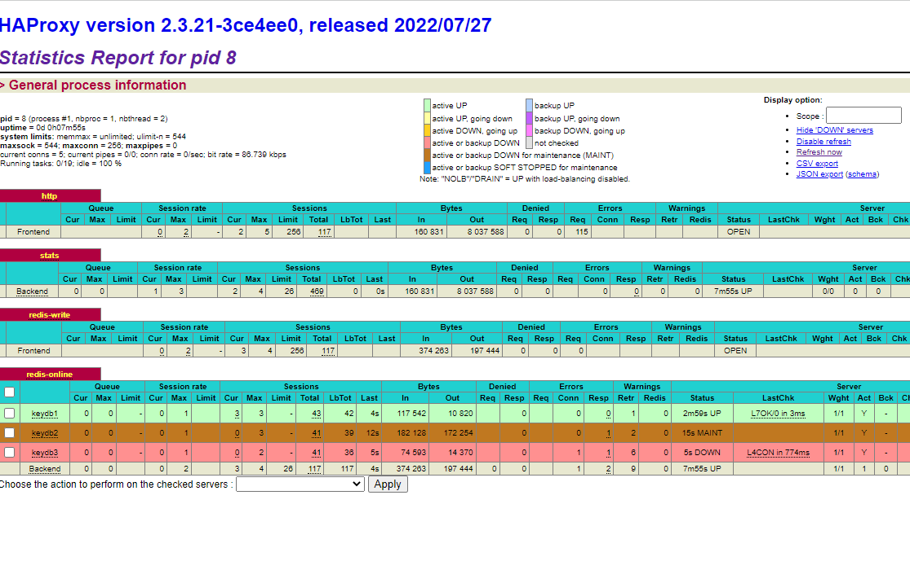

Title: Using a Microsoft AKS cluster to test Keydb's resilience with Python clients
Author: Ferdinando Simonetti
Tags: Kubernetes, Kubie, AKS, Redis, Keydb, Python 
Category: Kubernetes
Date: 2022-11-21
Modified: 2022-11-22

Today's task: verifying that a Keydb cluster, when deployed via Helm with default values (apart from activating LoadBalancer Service and a custom password), could be resilient to the sudden *death* of any one of its composing Pods, with no client connection's disruption.

Also today's task: learn to interact with Redis/Keydb via Python.

## References

- **Codeberg GIT repo for this project**: [https://codeberg.org/rimmon1971/kind-python-keydb](https://codeberg.org/rimmon1971/kind-python-keydb)
- **Kubie multicontext manager**: [https://github.com/sbstp/kubie](https://github.com/sbstp/kubie)

- **KeyDB Redis replacement**: [https://docs.keydb.dev/](https://docs.keydb.dev/)
- **KeyDB Helm Chart**: [https://artifacthub.io/packages/helm/enapter/keydb](https://artifacthub.io/packages/helm/enapter/keydb)

- **Using Python to interact with Redis**: [https://realpython.com/python-redis/](https://realpython.com/python-redis/)
- **Best practices for Redis clients**: [https://aws.amazon.com/blogs/database/best-practices-redis-clients-and-amazon-elasticache-for-redis/](https://aws.amazon.com/blogs/database/best-practices-redis-clients-and-amazon-elasticache-for-redis/)

- **How to setup HAProxy for Sentinel on Kubernetes**: [https://yaniv-bhemo.medium.com/how-to-setup-haproxy-for-redis-sentinel-on-kubernetes-37ee70e44464](https://yaniv-bhemo.medium.com/how-to-setup-haproxy-for-redis-sentinel-on-kubernetes-37ee70e44464)

## Reusing an existing, test, AKS cluster

Here we are:

```
ferdi@DESKTOP-NL6I2OD:~/kind-python-keydb$ az aks list -o table
Name    Location       ResourceGroup             KubernetesVersion    CurrentKubernetesVersion    ProvisioningState    Fqdn
------  -------------  ------------------------  -------------------  --------------------------  -------------------  ------------------------------------------------------------------
keydb   francecentral  DefaultResourceGroup-PAR  1.23.12              1.23.12                     Succeeded            keydb-defaultresourceg-f1fbee-d3388059.hcp.francecentral.azmk8s.io
```

Let's extract the related **kubeconfig** file

```
ferdi@DESKTOP-NL6I2OD:~/kind-python-keydb$ az aks get-credentials --admin --name keydb --resource-group DefaultResourceGroup-PAR --file ~/.kube/keydb.yml
The behavior of this command has been altered by the following extension: aks-preview
Merged "keydb-admin" as current context in /home/ferdi/.kube/keydb.yml
```

And making use of that, via **Kubie** multi-context manager.

```
ferdi@DESKTOP-NL6I2OD:~/kind-python-keydb$ sed -i 's/keydb-admin/keydb/g' /home/ferdi/.kube/keydb.yml
ferdi@DESKTOP-NL6I2OD:~/kind-python-keydb$ kubie ctx keydb
[keydb|default] ferdi@DESKTOP-NL6I2OD:~/kind-python-keydb$ kubectl get nodes
NAME                                STATUS   ROLES   AGE   VERSION
aks-nodepool1-21172355-vmss000000   Ready    agent   18d   v1.23.12
aks-nodepool1-21172355-vmss000001   Ready    agent   18d   v1.23.12
aks-nodepool1-21172355-vmss000002   Ready    agent   18d   v1.23.12
```

## Installing Keydb cluster with default values (except for a password)

First of all, we need to add Keydb's Helm repo:

```
[kind|default] ferdi@DESKTOP-NL6I2OD:~/kind-python-keydb$ helm repo add enapter https://enapter.github.io/charts/
"enapter" has been added to your repositories
```

Now we can perform a multi-master, active replica, three node Keydb cluster installation (with our carefully chosen password).
Discovering what does our password mean is left as an exercise for the reader :-)

```
[kind|default] ferdi@DESKTOP-NL6I2OD:~/kind-python-keydb$ helm upgrade --install keydb enapter/keydb --set password="Savignone.2015" --set loadBalancer.enabled=true
Release "keydb" does not exist. Installing it now.
NAME: keydb
LAST DEPLOYED: Mon Nov 21 11:15:06 2022
NAMESPACE: default
STATUS: deployed
REVISION: 1
TEST SUITE: None
```

## Reaching it 

We're going to run our Python code from the local PC, so we need to discover the Public IP through which our Keydb cluster is exposed.

```
[keydb|default] ferdi@DESKTOP-NL6I2OD:~/kind-python-keydb$ kubectl get svc
NAME             TYPE           CLUSTER-IP    EXTERNAL-IP   PORT(S)             AGE
keydb            ClusterIP      10.0.137.22   <none>        6379/TCP,9121/TCP   19m
keydb-headless   ClusterIP      None          <none>        6379/TCP            19m
keydb-lb         LoadBalancer   10.0.74.115   EDITED        6379:31052/TCP      19m
kubernetes       ClusterIP      10.0.0.1      <none>        443/TCP             18d
```

## Redis cluster support with Python

The *go-to* Python library [redis-py](https://redis-py.readthedocs.io/en/stable/) to interact with Redis used to lack **cluster** support.
In 2022, AWS people added this functionality (previously you had to choose another library to work with Redis clusters) to **redis-py**, as described [here](https://aws.amazon.com/blogs/opensource/new-cluster-mode-support-in-redis-py/).
However, when using this library against a KeyDB cluster, you **should not** instantiate a **RedisCluster** object: you should use the plain-and-simple **Redis** object, letting the internal KeyDB synchronization mechanism to work with your data.
There is also a [KeyDB-specific Python library](https://pypi.org/project/keydb/) but its development seems to have stopped 3 years ago.

## A Python virtualenv

I'm assuming that your Linux environment already has Python (3.7+) installed, along with the customary **python3-venv**, **python3-setuptools**, **python3-wheel** packages.
Let's create our virtual environment and proceed to install the Redis client library there.

```
ferdi@DESKTOP-NL6I2OD:~/kind-python-keydb$ python3 -m venv env
ferdi@DESKTOP-NL6I2OD:~/kind-python-keydb$ . env/bin/activate
(env) ferdi@DESKTOP-NL6I2OD:~/kind-python-keydb$ pip install redis
Collecting redis
  Downloading redis-4.3.4-py3-none-any.whl (246 kB)
     |████████████████████████████████| 246 kB 2.7 MB/s 
Collecting async-timeout>=4.0.2
  Using cached async_timeout-4.0.2-py3-none-any.whl (5.8 kB)
Collecting deprecated>=1.2.3
  Downloading Deprecated-1.2.13-py2.py3-none-any.whl (9.6 kB)
Collecting packaging>=20.4
  Using cached packaging-21.3-py3-none-any.whl (40 kB)
Collecting wrapt<2,>=1.10
  Downloading wrapt-1.14.1-cp38-cp38-manylinux_2_5_x86_64.manylinux1_x86_64.manylinux_2_17_x86_64.manylinux2014_x86_64.whl (81 kB)
     |████████████████████████████████| 81 kB 8.5 MB/s 
Collecting pyparsing!=3.0.5,>=2.0.2
  Using cached pyparsing-3.0.9-py3-none-any.whl (98 kB)
Installing collected packages: async-timeout, wrapt, deprecated, pyparsing, packaging, redis
Successfully installed async-timeout-4.0.2 deprecated-1.2.13 packaging-21.3 pyparsing-3.0.9 redis-4.3.4 wrapt-1.14.1
(env) ferdi@DESKTOP-NL6I2OD:~/kind-python-keydb$ pip freeze > requirements.txt
(env) ferdi@DESKTOP-NL6I2OD:~/kind-python-keydb$ cat requirements.txt 
async-timeout==4.0.2
Deprecated==1.2.13
packaging==21.3
pyparsing==3.0.9
redis==4.3.4
wrapt==1.14.1
```

## Poor man's Redis reader and writer

The goal is to verify the resilience of a KeyDB cluster, so there's nothing fancy in the code, apart from the retry_with_backoff function shamelessly stolen from the *Best Practices*'s AWS link.

### library.py

```
import redis
import random
from time import sleep
from redis.exceptions import ConnectionError, TimeoutError

def run_with_backoff(function, retries=5):
    base_backoff = 0.1
    max_backoff  = 10
    tries = 0
    while True:
        try:
            return function()
        except (ConnectionError,TimeoutError):
            if tries >= retries:
                raise
            backoff = min(max_backoff, base_backoff * (pow(2, tries) + random.random()))
            print(f"sleeping for {backoff:.2f}s")
            sleep(backoff)
            tries += 1
```

### writer.py

```
from library import *

random.seed(444)

pool = redis.BlockingConnectionPool(host='EDITED',port='6379',password='Savignone.2015',decode_responses=True)
r = redis.Redis(connection_pool=pool)

while True:
    for i in range(1000):
        valore = random.getrandbits(64)
        rs = run_with_backoff(lambda: r.set(f"chiave{i}",valore))
        print(f"{i} {valore} {rs}")
```
### reader.py

```
from library import *

random.seed(555)

pool = redis.BlockingConnectionPool(host='EDITED',port='6379',password='Savignone.2015',decode_responses=True)
r = redis.Redis(connection_pool=pool)

while True:
    chiave = random.randint(0,999)
    valore = run_with_backoff(lambda: r.get(f"chiave{chiave}"))
    print(f"{chiave} {valore}")
```

## First results

I launched both *reader.py* and *writer.py* from within the virtual environment, and I noticed that often, deleting one of the Pods part of the KeyDB StatefulSet, my client's connection was interrupted (and therefore the retry mechanism kicked in).

The customer, however, reads and writes Redis data in a way that doesn't tolerate connectivity loss.

So, next step: remove LoadBalancer Service from KeyDB (actually, I'm lazy, I'm letting it in place for now) and put **HAProxy** in front of it, exposing the **proxy** instead.

## Putting HAProxy at work

First of all: kudos to [Yaniv Ben Hemo](https://yaniv-bhemo.medium.com/about) for *putting it simple* with HAProxy on Kubernetes: relying on Kubernetes' DNS capabilities to resolve the individual KeyDB Pod's IP addresses is **effective**.

I've modified only the **ConfigMap** to reflect the fact that KeyDB is multi-master active-replica by default, and thus the writes can be distributed freely on each active backend node.

Additionally, I'm looking for *role:active-replica* and not *role:master* for the same reason.

Below there's a screenshot of HAProxy's stats page taken when I went berserk and killed **two out of three* KeyDB pods.
Both *reader* and *writer* Python scripts never noticed (after having been pointed to the *new* public IP).



And then, the complete YAML (Service, ConfigMap, Deployment) for our marvellous HAProxy.

```
apiVersion: /v1
kind: Service
metadata:
  name: haproxy-service
  namespace: default
spec:
  type: LoadBalancer
  ports:
    - name: dashboard
      port: 8080
      targetPort: 8080
    - name: redis-write
      port: 6379
      targetPort: 6379
  selector:
    app: haproxy
---
apiVersion: v1
kind: ConfigMap
metadata:
  name: haproxy-config
  namespace: default
data:
  haproxy.cfg: |
    global
    	daemon
    	maxconn 256
    
    defaults
    	mode tcp
    	timeout connect 5000ms
    	timeout client 50000ms
    	timeout server 50000ms
    
    
    frontend http
    	bind :8080
    	default_backend stats    
    
    backend stats
    	mode http
    	stats enable
    
    	stats enable
    	stats uri /
    	stats refresh 1s
    	stats show-legends
    	stats admin if TRUE
    
    resolvers k8s
      parse-resolv-conf
      hold other           10s
      hold refused         10s
      hold nx              10s
      hold timeout         10s
      hold valid           10s
      hold obsolete        10s
    
    frontend redis-write
        bind *:6379
    	default_backend redis-online
    
    backend redis-online
    	mode tcp
    	balance roundrobin
    	option tcp-check
    	tcp-check send AUTH\ Savignone.2015\r\n
    	tcp-check expect string +OK
    	tcp-check send PING\r\n
    	tcp-check expect string +PONG
      tcp-check send info\ replication\r\n
    	tcp-check expect string role:active-replica
      server-template keydb 3 server._tcp.keydb-headless.default.svc.cluster.local:6379 check inter 1s resolvers k8s init-addr none

---
apiVersion: apps/v1
kind: Deployment
metadata:
  name: haproxy-deployment
  namespace: default
  labels:
    app: haproxy
spec:
  replicas: 2
  selector:
    matchLabels:
      app: haproxy
  template:
    metadata:
      name: haproxy-pod
      labels:
        app: haproxy
    spec:
      affinity:
        podAntiAffinity:
          requiredDuringSchedulingIgnoredDuringExecution:
            - labelSelector:
                matchExpressions:
                - key: app
                  operator: In
                  values:
                    - haproxy
              topologyKey: "kubernetes.io/hostname"
      containers:
        - name: haproxy
          image: haproxy:2.3
          ports:
            - containerPort: 8080
            - containerPort: 6379
            - containerPort: 6380
          volumeMounts:
          - name: config
            mountPath: /usr/local/etc/haproxy/haproxy.cfg
            subPath: haproxy.cfg
            readOnly: true
      restartPolicy: Always
      volumes:
      - name: config
        configMap:
          name: haproxy-config
```