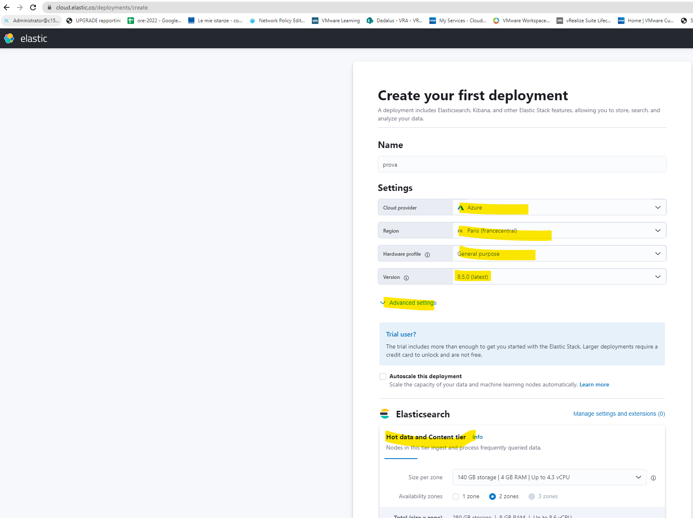
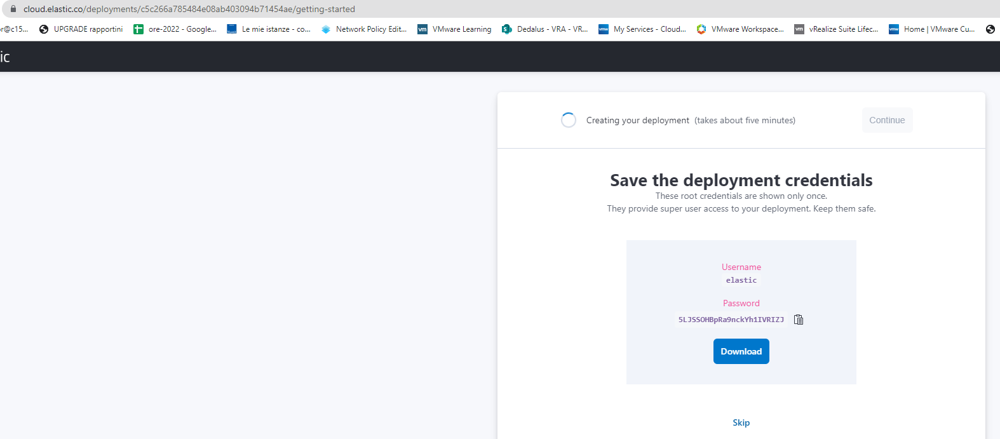
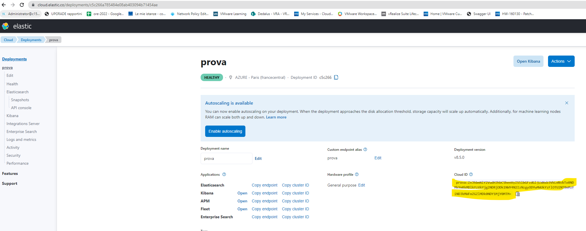

Title: Monitoring and logging for Kubernetes via Beats -> ElasticSearch (ECK or Elastic Cloud managed service), visualization with Kibana
Author: Ferdinando Simonetti
Tags: Kubernetes, k8s, Metricbeat, Filebeat, logging, monitoring, Elastisearch, ElasticCloud
Category: Kubernetes
Date: 2022-11-18

First of all, neither the monitored (test) AKS cluster nor the ElasticCloud (test) instance exist anymore, so I've kept the YAML files nearly unedited.
You'll find them (complete version) at the end of the article, while throughout it I'll reference some snippets of them.
Of course there's a lot of space for refining them, like referencing secrets for sensitive informations, setting up SSL trusted connections...

## Observed cluster's prerequisites

**Metricbeat** relies, to obtain some relevant data, on Kube-State-Metrics, you'll have to deploy it first (on kube-system namespace).

[https://artifacthub.io/packages/helm/prometheus-community/kube-state-metrics](https://artifacthub.io/packages/helm/prometheus-community/kube-state-metrics)

## Destination environments

- **Elastic Cloud**: [https://cloud.elastic.co](https://cloud.elastic.co)





You need to specify only the CloudID and Cloud Auth informations, the Elastic/Kibana target will be automagically resolved

```
    cloud.id: ${ELASTIC_CLOUD_ID}
    cloud.auth: ${ELASTIC_CLOUD_AUTH}
```
```
        - name: ELASTIC_CLOUD_ID
          value: "K8SMonitoring:ZnJhbmNlY2VudHJhbC5henVyZS5lbGFzdGljLWNsb3VkLmNvbTo0NDMkNWRhMmJmMzY3Y2JhNDgwN2E3ZjI4NGI3YTI2ODA4YjYkODg4ZjI3YTQzNjc1NDk1ZTg1YmYxNGIxNTgwYzIwZDg="
        - name: ELASTIC_CLOUD_AUTH
          value: "elastic:J0wA0yLuVs3RJRXix8YifX5X"
```

- **Elastic Cloud on Kubernetes (ECK)**: [https://www.elastic.co/guide/en/cloud-on-k8s/current/index.html](https://www.elastic.co/guide/en/cloud-on-k8s/current/index.html)

You'll need to specify both Elastic and Kibana endpoints (IP and port), as well as their credentials (maybe, by copying the ECK generated secret from the destination cluster)

```
    output.elasticsearch:
      hosts: ['${ELASTICSEARCH_HOST:elasticsearch}:${ELASTICSEARCH_PORT:9200}']
      username: ${ELASTICSEARCH_USERNAME}
      password: ${ELASTICSEARCH_PASSWORD}
      ssl.verification_mode: none

    setup.kibana:
      host: "${KIBANA_HOST}:${KIBANA_PORT}"
      ssl.verification_mode: none
```

```
        env:
        - name: ELASTICSEARCH_HOST
          value: "https://20.74.24.175"
        - name: ELASTICSEARCH_PORT
          value: "9200"
        - name: KIBANA_HOST
          value: "https://20.74.25.186"
        - name: KIBANA_PORT
          value: "5601"
        - name: ELASTICSEARCH_USERNAME
          value: elastic
        - name: ELASTICSEARCH_PASSWORD
          valueFrom:
            secretKeyRef:
              name: monitor-es-elastic-user
              key: elastic
```

## Processors' additional configuration

If you're planning to centralize logging and monitoring for multiple (AKS or K3S) clusters on a single ElasticSearch instance while retaining the ability of filtering "per cluster" incoming data, you should manually instruct Filebeat/Metricbeat to add the needed informations on every flow.

```
    processors:
      - add_cloud_metadata:
      - add_host_metadata:
      - add_fields:
          target: orchestrator.cluster
          fields:
            name: linkerdtest
            url: https://linkerdtest-dns-7975b0cb.hcp.francecentral.azmk8s.io:443
```
These informations could be easily retrieved via **kubectl cluster-info** and **kubectl config get-clusters** when connected to your referenced K8S cluster.

## Metricbeat Kubernetes-specific dashboards autodeploy

This additional setting on Metricbeat's config file will automatically load on destination's Kibana some useful dashboard (like *Kubernetes overview* and its subpanels).

```
    setup.dashboards.enabled: true
```

## Complete YAML files

### Destination Elasticsearch on managed ElasticSearch Cloud service

Logging with Filebeat

```
---
apiVersion: v1
kind: ServiceAccount
metadata:
  name: filebeat
  namespace: kube-system
  labels:
    k8s-app: filebeat
---
apiVersion: rbac.authorization.k8s.io/v1
kind: ClusterRoleBinding
metadata:
  name: filebeat
subjects:
- kind: ServiceAccount
  name: filebeat
  namespace: kube-system
roleRef:
  kind: ClusterRole
  name: filebeat
  apiGroup: rbac.authorization.k8s.io
---
apiVersion: rbac.authorization.k8s.io/v1
kind: RoleBinding
metadata:
  name: filebeat
  namespace: kube-system
subjects:
  - kind: ServiceAccount
    name: filebeat
    namespace: kube-system
roleRef:
  kind: Role
  name: filebeat
  apiGroup: rbac.authorization.k8s.io
---
apiVersion: rbac.authorization.k8s.io/v1
kind: RoleBinding
metadata:
  name: filebeat-kubeadm-config
  namespace: kube-system
subjects:
  - kind: ServiceAccount
    name: filebeat
    namespace: kube-system
roleRef:
  kind: Role
  name: filebeat-kubeadm-config
  apiGroup: rbac.authorization.k8s.io
---
apiVersion: rbac.authorization.k8s.io/v1
kind: ClusterRole
metadata:
  name: filebeat
  labels:
    k8s-app: filebeat
rules:
- apiGroups: [""] # "" indicates the core API group
  resources:
  - namespaces
  - pods
  - nodes
  verbs:
  - get
  - watch
  - list
- apiGroups: ["apps"]
  resources:
    - replicasets
  verbs: ["get", "list", "watch"]
- apiGroups: ["batch"]
  resources:
    - jobs
  verbs: ["get", "list", "watch"]
---
apiVersion: rbac.authorization.k8s.io/v1
kind: Role
metadata:
  name: filebeat
  # should be the namespace where filebeat is running
  namespace: kube-system
  labels:
    k8s-app: filebeat
rules:
  - apiGroups:
      - coordination.k8s.io
    resources:
      - leases
    verbs: ["get", "create", "update"]
---
apiVersion: rbac.authorization.k8s.io/v1
kind: Role
metadata:
  name: filebeat-kubeadm-config
  namespace: kube-system
  labels:
    k8s-app: filebeat
rules:
  - apiGroups: [""]
    resources:
      - configmaps
    resourceNames:
      - kubeadm-config
    verbs: ["get"]
---
apiVersion: v1
kind: ConfigMap
metadata:
  name: filebeat-config
  namespace: kube-system
  labels:
    k8s-app: filebeat
data:
  filebeat.yml: |-
    #filebeat.inputs:
    #- type: container
    #  paths:
    #    - /var/log/containers/*.log
    #  processors:
    #    - add_kubernetes_metadata:
    #        host: ${NODE_NAME}
    #        matchers:
    #        - logs_path:
    #            logs_path: "/var/log/containers/"

    # To enable hints based autodiscover, remove `filebeat.inputs` configuration and uncomment this:
    filebeat.autodiscover:
      providers:
        - type: kubernetes
          node: ${NODE_NAME}
          hints.enabled: true
          hints.default_config:
            type: container
            paths:
              - /var/log/containers/*${data.kubernetes.container.id}.log

    processors:
      - add_cloud_metadata:
      - add_host_metadata:
      - add_fields:
          target: orchestrator.cluster
          fields:
            name: linkerdtest
            url: https://linkerdtest-dns-7975b0cb.hcp.francecentral.azmk8s.io:443

    cloud.id: ${ELASTIC_CLOUD_ID}
    cloud.auth: ${ELASTIC_CLOUD_AUTH}

    output.elasticsearch:
      hosts: ['${ELASTICSEARCH_HOST:elasticsearch}:${ELASTICSEARCH_PORT:9200}']
      username: ${ELASTICSEARCH_USERNAME}
      password: ${ELASTICSEARCH_PASSWORD}
---
apiVersion: apps/v1
kind: DaemonSet
metadata:
  name: filebeat
  namespace: kube-system
  labels:
    k8s-app: filebeat
spec:
  selector:
    matchLabels:
      k8s-app: filebeat
  template:
    metadata:
      labels:
        k8s-app: filebeat
    spec:
      serviceAccountName: filebeat
      terminationGracePeriodSeconds: 30
      hostNetwork: true
      dnsPolicy: ClusterFirstWithHostNet
      containers:
      - name: filebeat
        image: docker.elastic.co/beats/filebeat:8.4.3
        args: [
          "-c", "/etc/filebeat.yml",
          "-e",
        ]
        env:
        - name: ELASTICSEARCH_HOST
          value: elasticsearch
        - name: ELASTICSEARCH_PORT
          value: "9200"
        - name: ELASTICSEARCH_USERNAME
          value: elastic
        - name: ELASTICSEARCH_PASSWORD
          value: changeme
        - name: ELASTIC_CLOUD_ID
          value: "K8SMonitoring:ZnJhbmNlY2VudHJhbC5henVyZS5lbGFzdGljLWNsb3VkLmNvbTo0NDMkNWRhMmJmMzY3Y2JhNDgwN2E3ZjI4NGI3YTI2ODA4YjYkODg4ZjI3YTQzNjc1NDk1ZTg1YmYxNGIxNTgwYzIwZDg="
        - name: ELASTIC_CLOUD_AUTH
          value: "elastic:J0wA0yLuVs3RJRXix8YifX5X"
        - name: NODE_NAME
          valueFrom:
            fieldRef:
              fieldPath: spec.nodeName
        securityContext:
          runAsUser: 0
          # If using Red Hat OpenShift uncomment this:
          #privileged: true
        resources:
          limits:
            memory: 1Gi
          requests:
            cpu: 100m
            memory: 100Mi
        volumeMounts:
        - name: config
          mountPath: /etc/filebeat.yml
          readOnly: true
          subPath: filebeat.yml
        - name: data
          mountPath: /usr/share/filebeat/data
        - name: varlibdockercontainers
          mountPath: /var/lib/docker/containers
          readOnly: true
        - name: varlog
          mountPath: /var/log
          readOnly: true
      volumes:
      - name: config
        configMap:
          defaultMode: 0640
          name: filebeat-config
      - name: varlibdockercontainers
        hostPath:
          path: /var/lib/docker/containers
      - name: varlog
        hostPath:
          path: /var/log
      # data folder stores a registry of read status for all files, so we don't send everything again on a Filebeat pod restart
      - name: data
        hostPath:
          # When filebeat runs as non-root user, this directory needs to be writable by group (g+w).
          path: /var/lib/filebeat-data
          type: DirectoryOrCreate

```

Monitoring with Metricbeat

```
---
apiVersion: v1
kind: ConfigMap
metadata:
  name: metricbeat-daemonset-config
  namespace: kube-system
  labels:
    k8s-app: metricbeat
data:
  metricbeat.yml: |-
    metricbeat.config.modules:
      # Mounted `metricbeat-daemonset-modules` configmap:
      path: ${path.config}/modules.d/*.yml
      # Reload module configs as they change:
      reload.enabled: false

    metricbeat.autodiscover:
      providers:
        - type: kubernetes
          scope: cluster
          node: ${NODE_NAME}
          # In large Kubernetes clusters consider setting unique to false
          # to avoid using the leader election strategy and
          # instead run a dedicated Metricbeat instance using a Deployment in addition to the DaemonSet
          unique: true
          templates:
            - config:
                - module: kubernetes
                  hosts: ["kube-state-metrics:8080"]
                  period: 10s
                  add_metadata: true
                  metricsets:
                    - state_node
                    - state_deployment
                    - state_daemonset
                    - state_replicaset
                    - state_pod
                    - state_container
                    - state_job
                    - state_cronjob
                    - state_resourcequota
                    - state_statefulset
                    - state_service
                    - state_persistentvolume
                    - state_persistentvolumeclaim
                    - state_storageclass
                  # If `https` is used to access `kube-state-metrics`, uncomment following settings:
                  # bearer_token_file: /var/run/secrets/kubernetes.io/serviceaccount/token
                  # ssl.certificate_authorities:
                  #   - /var/run/secrets/kubernetes.io/serviceaccount/service-ca.crt
                - module: kubernetes
                  metricsets:
                    - apiserver
                  hosts: ["https://${KUBERNETES_SERVICE_HOST}:${KUBERNETES_SERVICE_PORT}"]
                  bearer_token_file: /var/run/secrets/kubernetes.io/serviceaccount/token
                  ssl.certificate_authorities:
                    - /var/run/secrets/kubernetes.io/serviceaccount/ca.crt
                  period: 30s
                # Uncomment this to get k8s events:
                #- module: kubernetes
                #  metricsets:
                #    - event
        # To enable hints based autodiscover uncomment this:
        #- type: kubernetes
        #  node: ${NODE_NAME}
        #  hints.enabled: true

    processors:
      - add_cloud_metadata:
      - add_fields:
          target: orchestrator.cluster
          fields:
            name: linkerdtest
            url: https://linkerdtest-dns-7975b0cb.hcp.francecentral.azmk8s.io:443

    cloud.id: ${ELASTIC_CLOUD_ID}
    cloud.auth: ${ELASTIC_CLOUD_AUTH}

    output.elasticsearch:
      hosts: ['${ELASTICSEARCH_HOST:elasticsearch}:${ELASTICSEARCH_PORT:9200}']
      username: ${ELASTICSEARCH_USERNAME}
      password: ${ELASTICSEARCH_PASSWORD}

    setup.dashboards.enabled: true
---
apiVersion: v1
kind: ConfigMap
metadata:
  name: metricbeat-daemonset-modules
  namespace: kube-system
  labels:
    k8s-app: metricbeat
data:
  system.yml: |-
    - module: system
      period: 10s
      metricsets:
        - cpu
        - load
        - memory
        - network
        - process
        - process_summary
        #- core
        #- diskio
        #- socket
      processes: ['.*']
      process.include_top_n:
        by_cpu: 5      # include top 5 processes by CPU
        by_memory: 5   # include top 5 processes by memory

    - module: system
      period: 1m
      metricsets:
        - filesystem
        - fsstat
      processors:
      - drop_event.when.regexp:
          system.filesystem.mount_point: '^/(sys|cgroup|proc|dev|etc|host|lib|snap)($|/)'
  kubernetes.yml: |-
    - module: kubernetes
      metricsets:
        - node
        - system
        - pod
        - container
        - volume
      period: 10s
      host: ${NODE_NAME}
      hosts: ["https://${NODE_NAME}:10250"]
      bearer_token_file: /var/run/secrets/kubernetes.io/serviceaccount/token
      ssl.verification_mode: "none"
      # If there is a CA bundle that contains the issuer of the certificate used in the Kubelet API,
      # remove ssl.verification_mode entry and use the CA, for instance:
      #ssl.certificate_authorities:
        #- /var/run/secrets/kubernetes.io/serviceaccount/service-ca.crt
    - module: kubernetes
      metricsets:
        - proxy
      period: 10s
      host: ${NODE_NAME}
      hosts: ["localhost:10249"]
      # If using Red Hat OpenShift should be used this `hosts` setting instead:
      # hosts: ["localhost:29101"]
---
# Deploy a Metricbeat instance per node for node metrics retrieval
apiVersion: apps/v1
kind: DaemonSet
metadata:
  name: metricbeat
  namespace: kube-system
  labels:
    k8s-app: metricbeat
spec:
  selector:
    matchLabels:
      k8s-app: metricbeat
  template:
    metadata:
      labels:
        k8s-app: metricbeat
    spec:
      serviceAccountName: metricbeat
      terminationGracePeriodSeconds: 30
      hostNetwork: true
      dnsPolicy: ClusterFirstWithHostNet
      containers:
      - name: metricbeat
        image: docker.elastic.co/beats/metricbeat:8.4.3
        args: [
          "-c", "/etc/metricbeat.yml",
          "-e",
          "-system.hostfs=/hostfs",
        ]
        env:
        - name: ELASTICSEARCH_HOST
          value: elasticsearch
        - name: ELASTICSEARCH_PORT
          value: "9200"
        - name: ELASTICSEARCH_USERNAME
          value: elastic
        - name: ELASTICSEARCH_PASSWORD
          value: changeme
        - name: ELASTIC_CLOUD_ID
          value: "K8SMonitoring:ZnJhbmNlY2VudHJhbC5henVyZS5lbGFzdGljLWNsb3VkLmNvbTo0NDMkNWRhMmJmMzY3Y2JhNDgwN2E3ZjI4NGI3YTI2ODA4YjYkODg4ZjI3YTQzNjc1NDk1ZTg1YmYxNGIxNTgwYzIwZDg="
        - name: ELASTIC_CLOUD_AUTH
          value: "elastic:J0wA0yLuVs3RJRXix8YifX5X"
        - name: NODE_NAME
          valueFrom:
            fieldRef:
              fieldPath: spec.nodeName
        securityContext:
          runAsUser: 0
        resources:
          limits:
            memory: 200Mi
          requests:
            cpu: 100m
            memory: 100Mi
        volumeMounts:
        - name: config
          mountPath: /etc/metricbeat.yml
          readOnly: true
          subPath: metricbeat.yml
        - name: data
          mountPath: /usr/share/metricbeat/data
        - name: modules
          mountPath: /usr/share/metricbeat/modules.d
          readOnly: true
        - name: proc
          mountPath: /hostfs/proc
          readOnly: true
        - name: cgroup
          mountPath: /hostfs/sys/fs/cgroup
          readOnly: true
      volumes:
      - name: proc
        hostPath:
          path: /proc
      - name: cgroup
        hostPath:
          path: /sys/fs/cgroup
      - name: config
        configMap:
          defaultMode: 0640
          name: metricbeat-daemonset-config
      - name: modules
        configMap:
          defaultMode: 0640
          name: metricbeat-daemonset-modules
      - name: data
        hostPath:
          # When metricbeat runs as non-root user, this directory needs to be writable by group (g+w)
          path: /var/lib/metricbeat-data
          type: DirectoryOrCreate
---
apiVersion: rbac.authorization.k8s.io/v1
kind: ClusterRoleBinding
metadata:
  name: metricbeat
subjects:
- kind: ServiceAccount
  name: metricbeat
  namespace: kube-system
roleRef:
  kind: ClusterRole
  name: metricbeat
  apiGroup: rbac.authorization.k8s.io
---
apiVersion: rbac.authorization.k8s.io/v1
kind: RoleBinding
metadata:
  name: metricbeat
  namespace: kube-system
subjects:
  - kind: ServiceAccount
    name: metricbeat
    namespace: kube-system
roleRef:
  kind: Role
  name: metricbeat
  apiGroup: rbac.authorization.k8s.io
---
apiVersion: rbac.authorization.k8s.io/v1
kind: RoleBinding
metadata:
  name: metricbeat-kubeadm-config
  namespace: kube-system
subjects:
  - kind: ServiceAccount
    name: metricbeat
    namespace: kube-system
roleRef:
  kind: Role
  name: metricbeat-kubeadm-config
  apiGroup: rbac.authorization.k8s.io
---
apiVersion: rbac.authorization.k8s.io/v1
kind: ClusterRole
metadata:
  name: metricbeat
  labels:
    k8s-app: metricbeat
rules:
- apiGroups: [""]
  resources:
  - nodes
  - namespaces
  - events
  - pods
  - services
  - persistentvolumes
  - persistentvolumeclaims
  verbs: ["get", "list", "watch"]
# Enable this rule only if planing to use Kubernetes keystore
#- apiGroups: [""]
#  resources:
#  - secrets
#  verbs: ["get"]
- apiGroups: ["extensions"]
  resources:
  - replicasets
  verbs: ["get", "list", "watch"]
- apiGroups: ["apps"]
  resources:
  - statefulsets
  - deployments
  - replicasets
  - daemonsets
  verbs: ["get", "list", "watch"]
- apiGroups: ["batch"]
  resources:
  - jobs
  - cronjobs
  verbs: ["get", "list", "watch"]
- apiGroups: ["storage.k8s.io"]
  resources:
    - storageclasses
  verbs: ["get", "list", "watch"]
- apiGroups:
  - ""
  resources:
  - nodes/stats
  verbs:
  - get
- nonResourceURLs:
  - "/metrics"
  verbs:
  - get
---
apiVersion: rbac.authorization.k8s.io/v1
kind: Role
metadata:
  name: metricbeat
  # should be the namespace where metricbeat is running
  namespace: kube-system
  labels:
    k8s-app: metricbeat
rules:
  - apiGroups:
      - coordination.k8s.io
    resources:
      - leases
    verbs: ["get", "create", "update"]
---
apiVersion: rbac.authorization.k8s.io/v1
kind: Role
metadata:
  name: metricbeat-kubeadm-config
  namespace: kube-system
  labels:
    k8s-app: metricbeat
rules:
  - apiGroups: [""]
    resources:
      - configmaps
    resourceNames:
      - kubeadm-config
    verbs: ["get"]
---
apiVersion: v1
kind: ServiceAccount
metadata:
  name: metricbeat
  namespace: kube-system
  labels:
    k8s-app: metricbeat
```

### Destination Elasticsearch on ECK (Elastic Cloud on Kubernetes) or other ElasticSearch instance

Logging with Filebeat

```
---
apiVersion: v1
kind: ServiceAccount
metadata:
  name: filebeat
  namespace: kube-system
  labels:
    k8s-app: filebeat
---
apiVersion: rbac.authorization.k8s.io/v1
kind: ClusterRoleBinding
metadata:
  name: filebeat
subjects:
- kind: ServiceAccount
  name: filebeat
  namespace: kube-system
roleRef:
  kind: ClusterRole
  name: filebeat
  apiGroup: rbac.authorization.k8s.io
---
apiVersion: rbac.authorization.k8s.io/v1
kind: RoleBinding
metadata:
  name: filebeat
  namespace: kube-system
subjects:
  - kind: ServiceAccount
    name: filebeat
    namespace: kube-system
roleRef:
  kind: Role
  name: filebeat
  apiGroup: rbac.authorization.k8s.io
---
apiVersion: rbac.authorization.k8s.io/v1
kind: RoleBinding
metadata:
  name: filebeat-kubeadm-config
  namespace: kube-system
subjects:
  - kind: ServiceAccount
    name: filebeat
    namespace: kube-system
roleRef:
  kind: Role
  name: filebeat-kubeadm-config
  apiGroup: rbac.authorization.k8s.io
---
apiVersion: rbac.authorization.k8s.io/v1
kind: ClusterRole
metadata:
  name: filebeat
  labels:
    k8s-app: filebeat
rules:
- apiGroups: [""] # "" indicates the core API group
  resources:
  - namespaces
  - pods
  - nodes
  verbs:
  - get
  - watch
  - list
- apiGroups: ["apps"]
  resources:
    - replicasets
  verbs: ["get", "list", "watch"]
- apiGroups: ["batch"]
  resources:
    - jobs
  verbs: ["get", "list", "watch"]
---
apiVersion: rbac.authorization.k8s.io/v1
kind: Role
metadata:
  name: filebeat
  # should be the namespace where filebeat is running
  namespace: kube-system
  labels:
    k8s-app: filebeat
rules:
  - apiGroups:
      - coordination.k8s.io
    resources:
      - leases
    verbs: ["get", "create", "update"]
---
apiVersion: rbac.authorization.k8s.io/v1
kind: Role
metadata:
  name: filebeat-kubeadm-config
  namespace: kube-system
  labels:
    k8s-app: filebeat
rules:
  - apiGroups: [""]
    resources:
      - configmaps
    resourceNames:
      - kubeadm-config
    verbs: ["get"]
---
apiVersion: v1
kind: ConfigMap
metadata:
  name: filebeat-config
  namespace: kube-system
  labels:
    k8s-app: filebeat
data:
  filebeat.yml: |-
    #filebeat.inputs:
    #- type: container
    #  paths:
    #    - /var/log/containers/*.log
    #  processors:
    #    - add_kubernetes_metadata:
    #        host: ${NODE_NAME}
    #        matchers:
    #        - logs_path:
    #            logs_path: "/var/log/containers/"

    # To enable hints based autodiscover, remove `filebeat.inputs` configuration and uncomment this:
    filebeat.autodiscover:
      providers:
        - type: kubernetes
          node: ${NODE_NAME}
          hints.enabled: true
          hints.default_config:
            type: container
            paths:
              - /var/log/containers/*${data.kubernetes.container.id}.log

    processors:
      - add_cloud_metadata:
      - add_host_metadata:
      - add_fields:
          target: orchestrator.cluster
          fields:
            name: linkerdtest
            url: https://linkerdtest-dns-7975b0cb.hcp.francecentral.azmk8s.io:443

    output.elasticsearch:
      hosts: ['${ELASTICSEARCH_HOST:elasticsearch}:${ELASTICSEARCH_PORT:9200}']
      username: ${ELASTICSEARCH_USERNAME}
      password: ${ELASTICSEARCH_PASSWORD}
      ssl.verification_mode: none
---
apiVersion: apps/v1
kind: DaemonSet
metadata:
  name: filebeat
  namespace: kube-system
  labels:
    k8s-app: filebeat
spec:
  selector:
    matchLabels:
      k8s-app: filebeat
  template:
    metadata:
      labels:
        k8s-app: filebeat
    spec:
      serviceAccountName: filebeat
      terminationGracePeriodSeconds: 30
      hostNetwork: true
      dnsPolicy: ClusterFirstWithHostNet
      containers:
      - name: filebeat
        image: docker.elastic.co/beats/filebeat:8.4.3
        args: [
          "-c", "/etc/filebeat.yml",
          "-e",
        ]
        env:
        - name: ELASTICSEARCH_HOST
          value: "https://20.74.24.175"
        - name: ELASTICSEARCH_PORT
          value: "9200"
        - name: ELASTICSEARCH_USERNAME
          value: elastic
        - name: ELASTICSEARCH_PASSWORD
          valueFrom:
            secretKeyRef:
              name: monitor-es-elastic-user
              key: elastic
        - name: NODE_NAME
          valueFrom:
            fieldRef:
              fieldPath: spec.nodeName
        securityContext:
          runAsUser: 0
          # If using Red Hat OpenShift uncomment this:
          #privileged: true
        resources:
          limits:
            memory: 1Gi
          requests:
            cpu: 100m
            memory: 100Mi
        volumeMounts:
        - name: config
          mountPath: /etc/filebeat.yml
          readOnly: true
          subPath: filebeat.yml
        - name: data
          mountPath: /usr/share/filebeat/data
        - name: varlibdockercontainers
          mountPath: /var/lib/docker/containers
          readOnly: true
        - name: varlog
          mountPath: /var/log
          readOnly: true
      volumes:
      - name: config
        configMap:
          defaultMode: 0640
          name: filebeat-config
      - name: varlibdockercontainers
        hostPath:
          path: /var/lib/docker/containers
      - name: varlog
        hostPath:
          path: /var/log
      # data folder stores a registry of read status for all files, so we don't send everything again on a Filebeat pod restart
      - name: data
        hostPath:
          # When filebeat runs as non-root user, this directory needs to be writable by group (g+w).
          path: /var/lib/filebeat-data
          type: DirectoryOrCreate

```

Monitoring with Metricbeat

```
---
apiVersion: v1
kind: ConfigMap
metadata:
  name: metricbeat-daemonset-config
  namespace: kube-system
  labels:
    k8s-app: metricbeat
data:
  metricbeat.yml: |-
    metricbeat.config.modules:
      # Mounted `metricbeat-daemonset-modules` configmap:
      path: ${path.config}/modules.d/*.yml
      # Reload module configs as they change:
      reload.enabled: false

    metricbeat.autodiscover:
      providers:
        - type: kubernetes
          scope: cluster
          node: ${NODE_NAME}
          # In large Kubernetes clusters consider setting unique to false
          # to avoid using the leader election strategy and
          # instead run a dedicated Metricbeat instance using a Deployment in addition to the DaemonSet
          unique: true
          templates:
            - config:
                - module: kubernetes
                  hosts: ["kube-state-metrics:8080"]
                  period: 10s
                  add_metadata: true
                  metricsets:
                    - state_node
                    - state_deployment
                    - state_daemonset
                    - state_replicaset
                    - state_pod
                    - state_container
                    - state_job
                    - state_cronjob
                    - state_resourcequota
                    - state_statefulset
                    - state_service
                    - state_persistentvolume
                    - state_persistentvolumeclaim
                    - state_storageclass
                  # If `https` is used to access `kube-state-metrics`, uncomment following settings:
                  # bearer_token_file: /var/run/secrets/kubernetes.io/serviceaccount/token
                  # ssl.certificate_authorities:
                  #   - /var/run/secrets/kubernetes.io/serviceaccount/service-ca.crt
                - module: kubernetes
                  metricsets:
                    - apiserver
                  hosts: ["https://${KUBERNETES_SERVICE_HOST}:${KUBERNETES_SERVICE_PORT}"]
                  bearer_token_file: /var/run/secrets/kubernetes.io/serviceaccount/token
                  ssl.certificate_authorities:
                    - /var/run/secrets/kubernetes.io/serviceaccount/ca.crt
                  period: 30s
                # Uncomment this to get k8s events:
                #- module: kubernetes
                #  metricsets:
                #    - event
        # To enable hints based autodiscover uncomment this:
        #- type: kubernetes
        #  node: ${NODE_NAME}
        #  hints.enabled: true

    processors:
      - add_cloud_metadata:
      - add_fields:
          target: orchestrator.cluster
          fields:
            name: linkerdtest
            url: https://linkerdtest-dns-7975b0cb.hcp.francecentral.azmk8s.io:443

    output.elasticsearch:
      hosts: ['${ELASTICSEARCH_HOST:elasticsearch}:${ELASTICSEARCH_PORT:9200}']
      username: ${ELASTICSEARCH_USERNAME}
      password: ${ELASTICSEARCH_PASSWORD}
      ssl.verification_mode: none

    setup.kibana:
      host: "${KIBANA_HOST}:${KIBANA_PORT}"
      ssl.verification_mode: none

    setup.dashboards.enabled: true
---
apiVersion: v1
kind: ConfigMap
metadata:
  name: metricbeat-daemonset-modules
  namespace: kube-system
  labels:
    k8s-app: metricbeat
data:
  system.yml: |-
    - module: system
      period: 10s
      metricsets:
        - cpu
        - load
        - memory
        - network
        - process
        - process_summary
        #- core
        #- diskio
        #- socket
      processes: ['.*']
      process.include_top_n:
        by_cpu: 5      # include top 5 processes by CPU
        by_memory: 5   # include top 5 processes by memory

    - module: system
      period: 1m
      metricsets:
        - filesystem
        - fsstat
      processors:
      - drop_event.when.regexp:
          system.filesystem.mount_point: '^/(sys|cgroup|proc|dev|etc|host|lib|snap)($|/)'
  kubernetes.yml: |-
    - module: kubernetes
      metricsets:
        - node
        - system
        - pod
        - container
        - volume
      period: 10s
      host: ${NODE_NAME}
      hosts: ["https://${NODE_NAME}:10250"]
      bearer_token_file: /var/run/secrets/kubernetes.io/serviceaccount/token
      ssl.verification_mode: "none"
      # If there is a CA bundle that contains the issuer of the certificate used in the Kubelet API,
      # remove ssl.verification_mode entry and use the CA, for instance:
      #ssl.certificate_authorities:
        #- /var/run/secrets/kubernetes.io/serviceaccount/service-ca.crt
    - module: kubernetes
      metricsets:
        - proxy
      period: 10s
      host: ${NODE_NAME}
      hosts: ["localhost:10249"]
      # If using Red Hat OpenShift should be used this `hosts` setting instead:
      # hosts: ["localhost:29101"]
---
# Deploy a Metricbeat instance per node for node metrics retrieval
apiVersion: apps/v1
kind: DaemonSet
metadata:
  name: metricbeat
  namespace: kube-system
  labels:
    k8s-app: metricbeat
spec:
  selector:
    matchLabels:
      k8s-app: metricbeat
  template:
    metadata:
      labels:
        k8s-app: metricbeat
    spec:
      serviceAccountName: metricbeat
      terminationGracePeriodSeconds: 30
      hostNetwork: true
      dnsPolicy: ClusterFirstWithHostNet
      containers:
      - name: metricbeat
        image: docker.elastic.co/beats/metricbeat:8.4.3
        args: [
          "-c", "/etc/metricbeat.yml",
          "-e",
          "-system.hostfs=/hostfs",
        ]
        env:
        - name: ELASTICSEARCH_HOST
          value: "https://20.74.24.175"
        - name: ELASTICSEARCH_PORT
          value: "9200"
        - name: KIBANA_HOST
          value: "https://20.74.25.186"
        - name: KIBANA_PORT
          value: "5601"
        - name: ELASTICSEARCH_USERNAME
          value: elastic
        - name: ELASTICSEARCH_PASSWORD
          valueFrom:
            secretKeyRef:
              name: monitor-es-elastic-user
              key: elastic
        - name: NODE_NAME
          valueFrom:
            fieldRef:
              fieldPath: spec.nodeName
        securityContext:
          runAsUser: 0
        resources:
          limits:
            memory: 200Mi
          requests:
            cpu: 100m
            memory: 100Mi
        volumeMounts:
        - name: config
          mountPath: /etc/metricbeat.yml
          readOnly: true
          subPath: metricbeat.yml
        - name: data
          mountPath: /usr/share/metricbeat/data
        - name: modules
          mountPath: /usr/share/metricbeat/modules.d
          readOnly: true
        - name: proc
          mountPath: /hostfs/proc
          readOnly: true
        - name: cgroup
          mountPath: /hostfs/sys/fs/cgroup
          readOnly: true
      volumes:
      - name: proc
        hostPath:
          path: /proc
      - name: cgroup
        hostPath:
          path: /sys/fs/cgroup
      - name: config
        configMap:
          defaultMode: 0640
          name: metricbeat-daemonset-config
      - name: modules
        configMap:
          defaultMode: 0640
          name: metricbeat-daemonset-modules
      - name: data
        hostPath:
          # When metricbeat runs as non-root user, this directory needs to be writable by group (g+w)
          path: /var/lib/metricbeat-data
          type: DirectoryOrCreate
---
apiVersion: rbac.authorization.k8s.io/v1
kind: ClusterRoleBinding
metadata:
  name: metricbeat
subjects:
- kind: ServiceAccount
  name: metricbeat
  namespace: kube-system
roleRef:
  kind: ClusterRole
  name: metricbeat
  apiGroup: rbac.authorization.k8s.io
---
apiVersion: rbac.authorization.k8s.io/v1
kind: RoleBinding
metadata:
  name: metricbeat
  namespace: kube-system
subjects:
  - kind: ServiceAccount
    name: metricbeat
    namespace: kube-system
roleRef:
  kind: Role
  name: metricbeat
  apiGroup: rbac.authorization.k8s.io
---
apiVersion: rbac.authorization.k8s.io/v1
kind: RoleBinding
metadata:
  name: metricbeat-kubeadm-config
  namespace: kube-system
subjects:
  - kind: ServiceAccount
    name: metricbeat
    namespace: kube-system
roleRef:
  kind: Role
  name: metricbeat-kubeadm-config
  apiGroup: rbac.authorization.k8s.io
---
apiVersion: rbac.authorization.k8s.io/v1
kind: ClusterRole
metadata:
  name: metricbeat
  labels:
    k8s-app: metricbeat
rules:
- apiGroups: [""]
  resources:
  - nodes
  - namespaces
  - events
  - pods
  - services
  - persistentvolumes
  - persistentvolumeclaims
  verbs: ["get", "list", "watch"]
# Enable this rule only if planing to use Kubernetes keystore
#- apiGroups: [""]
#  resources:
#  - secrets
#  verbs: ["get"]
- apiGroups: ["extensions"]
  resources:
  - replicasets
  verbs: ["get", "list", "watch"]
- apiGroups: ["apps"]
  resources:
  - statefulsets
  - deployments
  - replicasets
  - daemonsets
  verbs: ["get", "list", "watch"]
- apiGroups: ["batch"]
  resources:
  - jobs
  - cronjobs
  verbs: ["get", "list", "watch"]
- apiGroups: ["storage.k8s.io"]
  resources:
    - storageclasses
  verbs: ["get", "list", "watch"]
- apiGroups:
  - ""
  resources:
  - nodes/stats
  verbs:
  - get
- nonResourceURLs:
  - "/metrics"
  verbs:
  - get
---
apiVersion: rbac.authorization.k8s.io/v1
kind: Role
metadata:
  name: metricbeat
  # should be the namespace where metricbeat is running
  namespace: kube-system
  labels:
    k8s-app: metricbeat
rules:
  - apiGroups:
      - coordination.k8s.io
    resources:
      - leases
    verbs: ["get", "create", "update"]
---
apiVersion: rbac.authorization.k8s.io/v1
kind: Role
metadata:
  name: metricbeat-kubeadm-config
  namespace: kube-system
  labels:
    k8s-app: metricbeat
rules:
  - apiGroups: [""]
    resources:
      - configmaps
    resourceNames:
      - kubeadm-config
    verbs: ["get"]
---
apiVersion: v1
kind: ServiceAccount
metadata:
  name: metricbeat
  namespace: kube-system
  labels:
    k8s-app: metricbeat
```