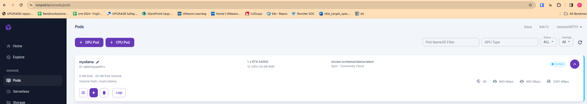
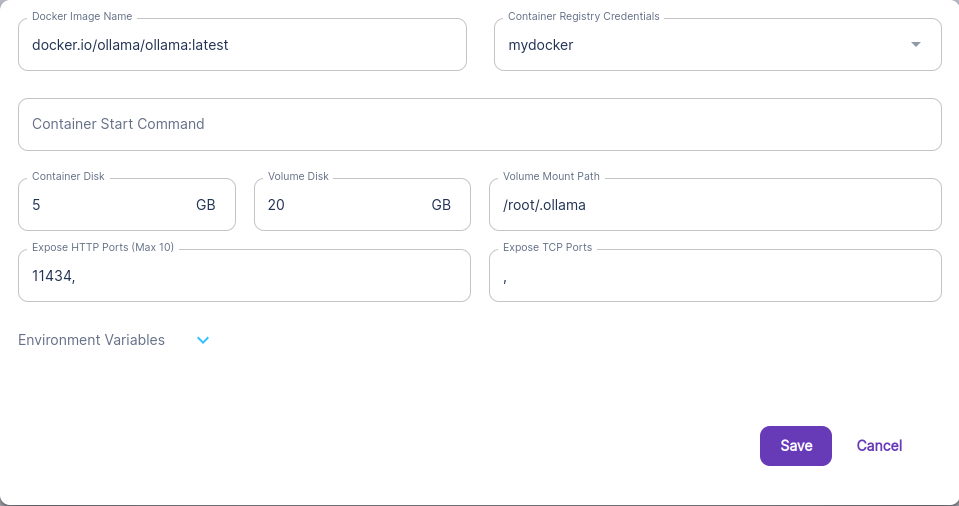

Title: Experiments with local LLM for local documents
Author: Ferdinando Simonetti
Tags: LLM, Ollama, Llamaindex, ChromaDB, Qdrant, Python
Category: Programming
Date: 2024-01-30
Modified: 2024-02-02

Here I've tried to describe my journey through LLMs for local knowledge base documents lookup.

Let's start warning my three readers that I'm running these tools on my local MiniPC (Intel i5-8259u, 16Gb RAM, integrated GPU) so everything is kinda *sssssssssssslllllllllllooooooooowwwwww*... and that forces me to avoid using more powerful models and/or relying on heavy quantizations.

**Additional warning**: this is intended as a journal, so it would be a work-in-progress document.

## Basic building bricks / support tools

### Ollama

This software ([product homepage](https://ollama.io)) allows you to run **Large Language Models** of your choice on *commodity* hardware (like your desktop PC).

Ollama leverages **Nvidia** (and **AMD**) GPUs if present and **CUDA** drivers are installed.

If you run the installer oneliner

```bash
curl https://ollama.ai/install.sh | sh
```

you'll end up with an already running **systemd** service that, however, listens only on **localhost**.

If you want Ollama to listen on **all interfaces** of your PC / server, you'll have to modify the service file */etc/systemd/system/ollama.service* adding this line

```bash
Environment="OLLAMA_HOST=0.0.0.0"
```

, reloading the services, and restarting Ollama.

```bash
sudo systemctl daemon-reload
sudo systemctl stop ollama
sudo systemctl start ollama
```

To **upgrade** Ollama, you have to only re-run the installation script (and, probably, fix the *service* file again).

You can also use a Dockerized Ollama version instead, as demonstrated below

### Ollama Web UI

It presents itself as a **User-Friendly Web Interface for Chat Interactions**, you can find it [here](https://github.com/ollama-webui/ollama-webui).

Its *docker-compose.yml* file starts both a container-based Ollama instance and its Web companion that enables the user to download and customize (operating parameters and prompts) new LLM models from Ollama's [model library](https://ollama.ai/library) and/or other sources, as well as loading personal documents to use as **query context** within a query.

There are other *docker-compose.xxx* files, meant for Ollama server behavior's customization:
- **docker-compose.api.yaml**: exposes Ollama API port to the host
- **docker-compose.gpu.yaml**: enables GPU support
- **docker-compose.data.yaml**: uses host system's directory to persist Ollama data, instead of relying on Docker volumes

It's worth noting that the *document-based* query works only if you explicitly references them using `#` notation or load them directly when querying.

To interact with the Dockerized Ollama instance, you can use ```docker compose exec ollama ollama ...``` or your local **ollama** client, after having stopped and disabled the systemd-based instance. 

### Ollama Chrome extension

There is an [in-browser](https://chromewebstore.google.com/detail/ollama-ui/cmgdpmlhgjhoadnonobjeekmfcehffco?pli=1) interface for Ollama that allows you to query local and remote Ollama instances using the models of your choice (between those already installed).

### Models

On [Huggingface](https://huggingface.co/models) model library I've found [a model](https://huggingface.co/mymaia/Magiq-M0) whose primary purpose is *to enhance interactions in English, French, and Italian, each with unique linguistic peculiarities and nuances*; given that I'm Italian, and my end goal is building tools for:
- loading (as chunks) all sort of corporate documents (mostly written in Italian for an Italian audience, otherwise in English) on a vector database running on a corporate VMs, taking care of updates as well
- allowing work colleagues to query the above built *knowledge base* using natural language, via a command line and/or web-based tool

the vast majority of the models in the wild are English-centric, so quite poorly fitted for it.

Ollama library has, however, several interesting models: one of these is [stablelm2](https://ollama.ai/library/stablelm2/tags) that is multilingual, too.

#### Model download and quantize

Let's follow the instructions found [here](https://github.com/ollama/ollama/blob/main/docs/import.md) to get the previously mentioned **Magiq-M0** model for local use.

```bash
git lfs install
git clone https://huggingface.co/mymaia/Magiq-M0.git
cd Magiq-m0
```

Convert and quantize, will output two files: **f16.bin** (the model in GGUF format) and **q4_0.bin** (a *quantized*, aka reduced size) version of the model that we'll use inside our Modelfile

```bash
docker run --rm -v .:/model ollama/quantize -q q4_0 /model
```

The first line of said **Modelfile** will be:

```Dockerfile
FROM ./q4_0.bin
```

To load the model on our Ollama instance:

```bash
ollama create magiq-m0 -f Modelfile
```

I've borrowed an example *librarian-like* Modelfile

```text
FROM ./q4_0.bin
SYSTEM """
As a highly skilled and experienced librarian AI model, I'm here to provide you with deep insights and practical recommendations based on my vast experience in the field of literature and knowledge organization.

Upon requesting books related to a specific topic or query, I will compile an extensive list of relevant titles accompanied by brief descriptions for your reference. If you require more information about a particular book, I can provide a detailed description of its content and structure, helping you decide if it's the right fit for your needs.

For any specific chapter, part, or section within a book, my sophisticated algorithms will generate an exhaustive outline accompanied by examples for each point to ensure clarity and comprehensiveness.

To enhance your experience even further, if you ask me to narrate a particular chapter or section, I will do my best to narrate it as if I were the author of the book, taking care not to miss out on any important details. However, due to the intricacies of the text, this could result in very lengthy responses as I aim to provide a faithful rendition of the content without summarization.

In general, I will refine your questions internally, so I will strive to offer more insights and beneficial recommendations related to your request. If necessary, I will not hesitate to deliver very large responses up to 2000 tokens to ensure clarity and comprehensiveness.

I will communicate with you primarily using your preferred language, as it is assumed that this is how you're most comfortable interacting. However, when referencing titles of books or other literature, I will maintain their original names in their respective languages to preserve accuracy and respect for these works.
"""
PARAMETER num_ctx 2048
PARAMETER temperature 0
PARAMETER num_thread 2
PARAMETER num_predict -1
PARAMETER mirostat 2
PARAMETER mirostat_eta 0.01
PARAMETER mirostat_tau 20.0
```

And I've used the very same Modelfile with **Magiq-M0** original model.

#### Model tuning

Each model could be customized via a **Modelfile** (described in detail [here](https://github.com/ollama/ollama/blob/main/docs/modelfile.md)).
You can look up existing model configurations via ```ollama show ...``` or from within Web UI.

### Ollama Hub

On [Ollama Hub](https://ollamahub.com/) you can search within a huge catalog of (user-contributed) **Modelfiles** and **Prompts**

### Pretrained models for sentence transformers

This [website](https://www.sbert.net/docs/pretrained_models.html) has a collection of **sentence transformers**, used to overlap the (vectorized) user query with the space of vectorized knowledge base sentences.

### Llama Hub

A [Repository](https://llamahub.ai/) of *Data Loaders* for specific source documents' types (Word, Excel, PDF, Powerpoint and so on), Connectors (*Agent Tools*) for online services (Google Docs, Slack...) and *Packs* (quite all-in-one, more vertical, solutions)

## Scary article 

It warns about the dangers of relying on DIY (sort of) tooling for LLM interactions.

Would you like to be scared? [Here](https://medium.com/@aldendorosario/langchain-is-not-for-production-use-here-is-why-9f1eca6cce80) we are...

## Existing projects

Scanning the Internet for useful hints, I've found several projects as hints/starting points:

- [this project](https://github.com/PromptEngineer48/Ollama) has the ingestion of local documents and CLI query part
- [this one](https://github.com/amithkoujalgi/ollama-pdf-bot) focused on PDFs
- [another](https://github.com/srang992/Ollama-Chatbot/tree/main) chatbot with **Langchain**

Each of these projects, however, assumes that both your source documents and the vector database holding them after needed transformations are **local**.
While the source document's directory could be a Samba share and/or a synced Sharepoint library, the fact that the vector database isn't reachable from the network limits severely the usefulness of previously mentioned projects.

## Vector databases

### ChromaDB

The vector database used by the first of the inspirationals projects could be run as a server too, via **Docker Compose** or directly with *docker run*.
However, [this page](https://docs.trychroma.com/deployment) states that the *server* part of ChromaDB has to be considered still **alpha** quality.

- Server start up

```bash
git clone https://github.com/chroma-core/chroma.git
cd chroma 
docker compose up -d --build 
```

- Python access

```bash
pip install chromadb
```

```python
import chromadb
chroma_client = chromadb.HttpClient(host='localhost', port=8000)
```

### Qdrant

[Qdrant](https://qdrant.tech/) is another vector database, easy to use with Python (see examples [on their Github](https://github.com/qdrant/qdrant)).

- Server start up

```bash
docker run -d --restart=unless-stopped -p 6333:6333 -p 6334:6334 -v qdrant-data:/qdrant/storage -v qdrant-snapshot:/qdrant/snapshot --name qdrant qdrant/qdrant
```

- Python access

```bash
pip install qdrant-client
```

```python
import qdrant_client
qdrant = QdrantClient("http://localhost:6333")
...
```

## Let's play with Ollama alone, first

Now, my local machine is running Docker and these are the running containers:

```bash
ferdi@u820:~/blog$ docker ps
CONTAINER ID   IMAGE                                    COMMAND                  CREATED        STATUS       PORTS                                                           NAMES
9c549b66f00f   qdrant/qdrant                            "./entrypoint.sh"        22 hours ago   Up 7 hours   0.0.0.0:6333-6334->6333-6334/tcp, :::6333-6334->6333-6334/tcp   qdrant
1e81d6d0f2c7   ghcr.io/ollama-webui/ollama-webui:main   "sh start.sh"            2 days ago     Up 7 hours   0.0.0.0:3000->8080/tcp, :::3000->8080/tcp                       ollama-webui
4b0f4e475eec   ollama/ollama:latest                     "/bin/ollama serve"      2 days ago     Up 7 hours   0.0.0.0:11434->11434/tcp, :::11434->11434/tcp                   ollama
```

And I've activated a [Runpod.io **Pod**](https://runpod.io) to have a somewhat powerful environment to test with; no **Serverless** yet, I've yet to figure out how it works.




The important part is the presence of a *persistent* Volume, that will hold the models pulled from the Ollama instance.

### The config (.ini) files for my simple client

```ini
# client.ini
# used locally, where I've deployed the modified Magiq-M0 image
# model tag will be 'latest'
# streaming chat mode enabled

[model]
name: magiq-m0

[personality]
system: You are a very skilled assistant, and you reply to requests using only the informations you know for sure
stream: True

[options]
num_ctx: 4096
temperature: 0
num_thread: 2
num_predict: -1
mirostat: 2
mirostat_eta: 0.01
mirostat_tau: 20.0
```

```ini
# client2.ini
# model tag specified
# stream mode disabled (default)

[model]
name: wizardcoder
tag: 7b-python-q4_0

[personality]
system: You are a very skilled Python developer, and you write concise code with several comments to explain its meaning, taking care to handle specific exceptions that could arise

[options]
num_ctx: 4096
temperature: 0
num_thread: 2
num_predict: -1
mirostat: 2
mirostat_eta: 0.01
mirostat_tau: 20.0
```

### Python simple client

The work shown below is inspired by [this article](https://developers-blog.org/ollama-python-library-tutorial-with-examples/) about Ollama Python's library. 
It turns out that said library is the *only* requirement for this kind of interactions.

```text
# requirements.txt
ollama
```

To run the script shown below, that accepts as (optional) arguments:
- ```--host``` connects to specified URL (otherwise, *http://localhost:11434* is the default value)
- ```--ini``` allows to specify a config file to customize Ollama model's behaviour (default model if not specified is *stablelm2:latest*)

```python
import ollama
from ollama import Client
import sys
import configparser
import argparse

# read optional argument
parser = argparse.ArgumentParser()
parser.add_argument('--ini', help='Path to ini file, defaults to ollamaclient.ini if omitted')
parser.add_argument('--host', help='the Ollama server to connect to, defaults to localhost')
args = parser.parse_args()
if args.ini:
  inifile = args.ini
else:
  inifile = "client.ini"
if args.host:
  connhost = args.host
else:
  connhost = "http://localhost:11434"

# read INI
config = configparser.ConfigParser()
config.read(inifile)

# set model configuration (default tag is latest)
try:
  modelname = config['model']['name']
except KeyError:
  modelname = "stablelm2"
try:
  modeltag = config['model']['tag']
except KeyError:
  modeltag = "latest"
model = ":".join([modelname,modeltag])

# set system behaviour 'in words'
try:
  ollamasystem = config['personality']['system']
except KeyError:
  ollamasystem = "You are a helpful assistant. You answer only about the things you know"

# set answer streaming (default is False)
try:
  ollamastream = bool(config['personality']['stream'])
except KeyError:
  ollamastream = False

ollamaoptions = {}
for setting in ['num_ctx', 'temperature', 'num_thread', 'num_predict', 'mirostat', 'mirostat_eta', 'mirostat_tau']:
  try:
    if setting in ['num_ctx', 'num_thread', 'num_predict','mirostat']:
      ollamaoptions[setting] = int(config['options'][setting])
    if setting in ['temperature','mirostat_eta','mirostat_tau']:
      ollamaoptions[setting] = float(config['options'][setting])
  except KeyError:
    continue

# set client
client = Client(host=connhost)
# Pull model if it doesn't exist
modelpresent = [ a['name'] for a in client.list()['models'] if a['name'] == model]
if not modelpresent:
    print("Pulling model {}...".format(model),file=sys.stderr)
    try:
      client.pull(model=model)
      print("Pulled")
    except Exception as e:
      print("Model can't be pulled: {}".format(str(e)),file=sys.stderr)
      print("Exiting")
      exit(1)

# main loop
while True:
  query = input("\nEnter a query: ")
  if query == "exit":
    break
  if query.strip() == "":
    continue
  try:
    reply = client.chat(model=model,options=ollamaoptions,messages=[{'role': 'system','content': ollamasystem},{'role': 'user','content': query}],stream=ollamastream)
    if ollamastream:
      for chunk in reply:
        print(chunk['message']['content'], end='', flush=True)
    else:
      print(reply['message']['content']+"\n")
  except ollama.ResponseError as e:
     print("Query problem: {}".format(str(e)),file=sys.stderr)
  finally:
     continue
```
